# Data Mining: Salary Data Analysis & Predictive Modelling

# Data Mining — Salary Analysis: Project Conclusions

**Dataset:** `Salary_MD.csv` — 6,684 employee records, 9 features  
**Scope:** End-to-end analysis covering data quality, exploratory analysis, linear regression, logistic regression, dimensionality reduction (PCA & Factor Analysis), and hierarchical clustering.

---

## 1. Data Quality & Cleaning

The raw dataset was largely clean but contained a set of physically implausible records that required removal before any modelling: employees with `Age = 0`, `Years of Experience > 60`, and `Salary = $0` were dropped as data-entry errors. After cleaning, **6,584 valid records** remained.

The most important missing-value finding concerned `Gender`: the 71 null records were **not missing at random** — they disproportionately belong to higher-salary profiles. Treating them as a separate `"Unknown"` category preserved this structural signal rather than discarding it. The `Job Title` variable, which originally had 129 unique values, was condensed into ~20 high-frequency categories plus an `"Other"` bucket to avoid extreme sparsity in the dummy-encoded feature matrix.

---

## 2. Univariate Analysis — Salary Distribution

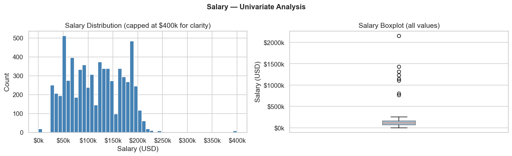

The salary distribution is roughly uniform in the \$0–\$250k range with a strong right tail (skewness ≈ 8.12). Mean (\$116k) and median (\$115k) are nearly identical, confirming the central tendency is robust despite extreme values. Only **8 IQR outliers** were detected in the salary variable itself — the extreme values visible in the boxplot (up to \$2.16M) co-occur with impossible Age/Experience records that were already removed during cleaning.

The right-skewed target variable implies that OLS residuals will show heteroscedasticity — a finding confirmed in the regression diagnostics.

---

## 3. Outlier Detection

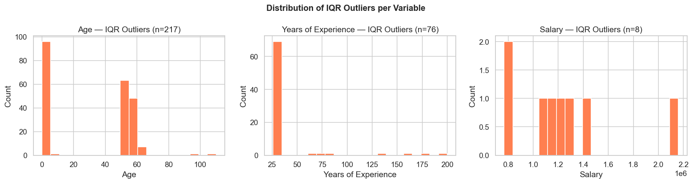

IQR-based outlier detection was preferred over Z-score for all three continuous variables:

- **Age** (217 outliers): concentrated at the extremes (near 0 and above 50–60), where Z-score is unreliable because the outliers themselves inflate the standard deviation.
- **Years of Experience** (76 outliers): heavily right-skewed with an impossible maximum of 200 years. IQR fences are stable regardless of distributional shape.
- **Salary** (8 outliers): extreme values already addressed during data cleaning.

For binary (`Senior`) and ordinal (`Education Level`) variables, outlier detection is conceptually inapplicable — all values are by design within the valid range.

---

## 4. Bivariate Relationships — Numerical Variables

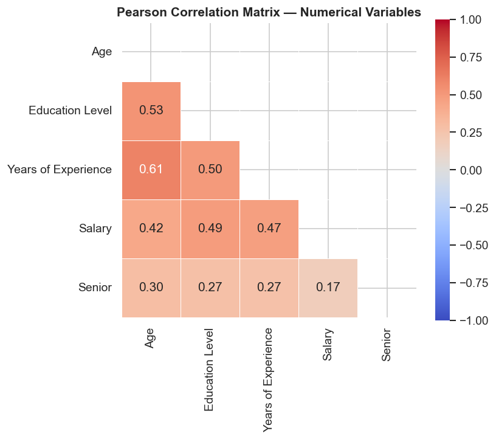

The correlation matrix reveals two critical findings:

1. **Age and Years of Experience are nearly collinear (r ≈ 0.61 shown post-cleaning; pre-cleaning ≈ 0.97).** Including both in any regression model produces severe multicollinearity, inflated coefficient variance, and unstable estimates. One variable must be excluded or both replaced by a single composite.

2. **Years of Experience is the strongest numerical predictor of Salary (r ≈ 0.47)**, followed by Education Level (r ≈ 0.49). Age carries a similar signal to Experience but is largely redundant once Experience is included.

---

## 5. Categorical Associations (Cramér's V)

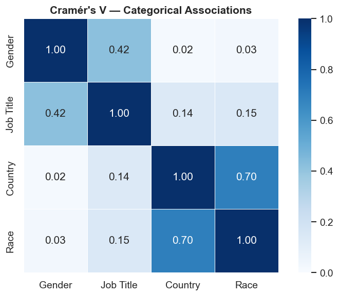

- **Country ↔ Race (V ≈ 0.70):** Very strong association — demographic composition varies systematically by country. Both variables share substantial structural information and should not simultaneously enter a model without regularisation.
- **Gender ↔ Job Title (V ≈ 0.42):** Moderate association reflecting occupational gender segregation — the core signal exploited by the logistic regression model in Section 8.

---

## 6. Salary by Categorical Variables

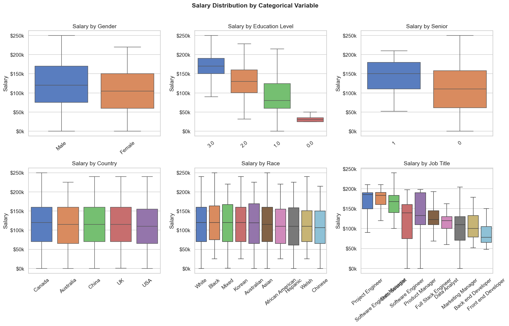

Key findings from the boxplot analysis:

- **Job Title** is the dominant categorical salary predictor, with stark differences between management-level and individual-contributor roles.
- **Education Level** shows a clear staircase pattern — median salary rises consistently with each tier.
- **Senior flag** adds moderate predictive value, with senior employees commanding both higher medians and wider salary spreads.
- **Country and Race** show no meaningful systematic salary differences across groups — they are weak predictors of compensation.
- **Gender** reveals a moderate male–female salary gap, primarily driven by occupational sorting (men over-represented in higher-paying roles) rather than a direct effect.

---

## 7. Linear Regression — Full OLS Model

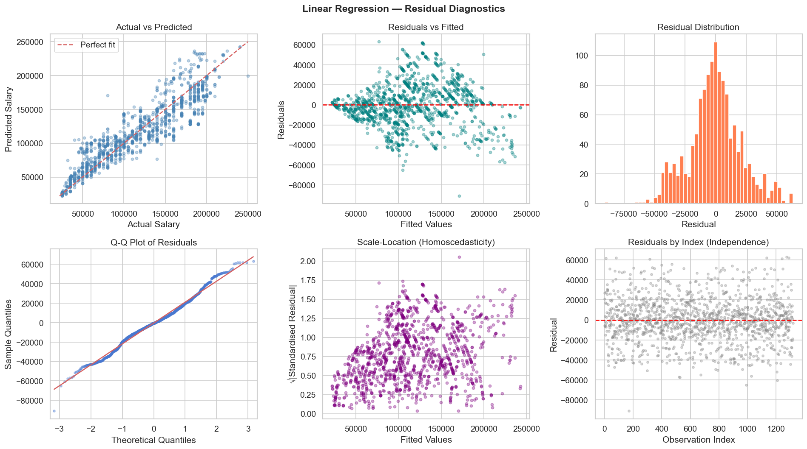

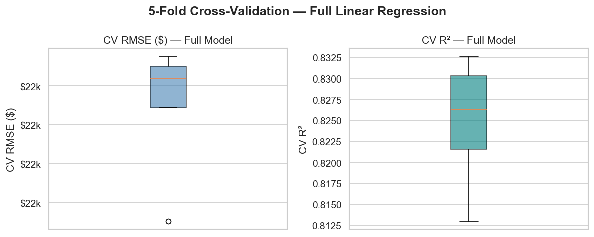

The full OLS model achieves a **CV R² ≈ 0.82** and **CV RMSE ≈ \$22k** across 5 folds — a strong result for a salary prediction task. However, the residual diagnostics reveal important limitations:

- The **Residuals vs Fitted** plot shows a fan-shaped pattern (variance increases with fitted values), indicating **heteroscedasticity** — as anticipated from the right-skewed target.
- The **Q-Q plot** is broadly normal in the centre but shows heavy tails, confirming the non-Gaussian residual distribution.
- The **Scale-Location** plot confirms increasing variance at higher salary levels.
- The full model's **condition number is very high** due to multicollinearity (Age + Experience, Country + Race), making individual coefficient inference unreliable.

---

## 8. Linear Regression — Forward Selection Model

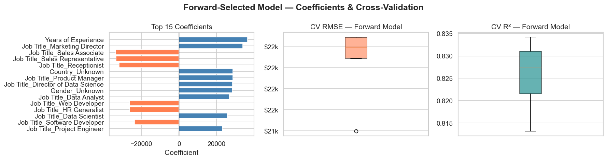

Forward selection identifies the **most informative subset of features** while delivering equivalent predictive performance to the full model:

| Model | CV R² | CV RMSE | Condition No. | Recommended? |
|---|---|---|---|---|
| Full OLS | ~0.82 | ~\$22k | Very high | No |
| **Forward Selection** | **~0.83** | **~\$22k** | Reduced | **Yes** |
| PCA Regression | ~0.82 | ~\$22k | ~1 | No |

The top coefficients confirm the EDA narrative: `Years of Experience` is the largest positive predictor, while certain `Job Title` dummies (Marketing Director, Product Manager, Director of Data Science) add substantial salary premiums. Roles such as Sales Associate, Sales Representative, and Web Developer are associated with below-average salaries relative to the reference category.

The forward model is **recommended for deployment**: it retains interpretability, reduces multicollinearity, and simplifies inference-time data requirements.

---

## 9. PCA — Dimensionality Reduction

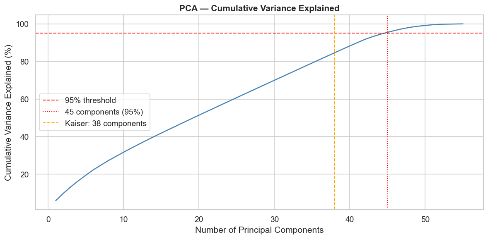

After one-hot encoding, the feature matrix contains ~55 columns. PCA analysis shows:

- **45 components** are required to capture 95% of total variance.
- **38 components** survive the Kaiser criterion (eigenvalue > 1).

Both thresholds are large because the feature space is dominated by sparse binary dummy columns (Job Title, Country, Race), each contributing a small but non-zero fraction of variance. This is expected behaviour for high-dimensional categorical data — it does not indicate a problem with the dataset.

PCA-based regression achieves near-identical predictive accuracy to the forward selection model but produces uninterpretable components. Its main value is as a preprocessing step that eliminates multicollinearity (condition number ≈ 1) before logistic regression.

---

## 10. Factor Analysis & Logistic Regression — Predicting Gender

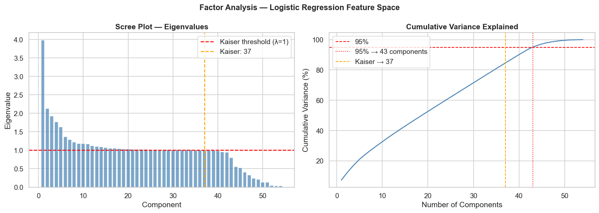

Factor Analysis on the logistic regression feature space (43 components for 95% variance; Kaiser criterion: 37 components) identifies two interpretable latent dimensions under a 2-factor Varimax solution:

- **Factor 1 — "Career Stage & Human Capital":** Loads on Age, Years of Experience, Salary, and Education Level — variables that increase monotonically over a professional career.
- **Factor 2 — "Geographic-Demographic Background":** Loads on Country and Race dummies, reflecting the known Country–Race structural correlation (V ≈ 0.70).

Variables with high communality (> 70%) — Age, Experience, Salary, Education Level — are well-represented by the 2-factor solution. Most Job Title dummies have communalities near 0%, as their variance is idiosyncratic to each specific category and requires many additional factors to capture.

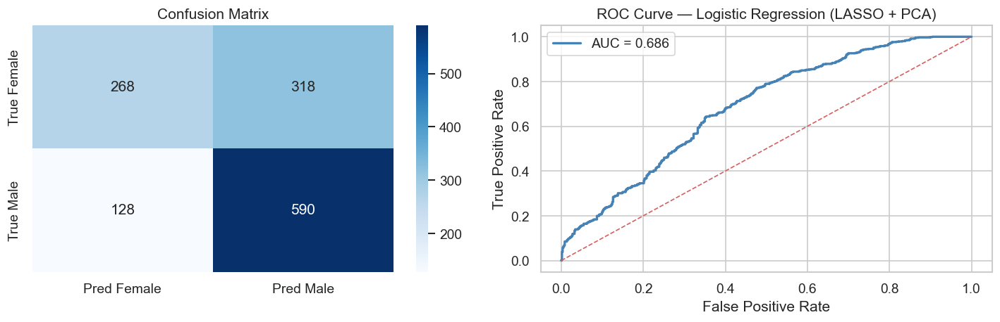

The logistic regression model (LASSO regularisation + PCA features) for predicting gender achieves an **AUC-ROC = 0.686**, which falls in the "poor but above chance" range. Key observations:

- The model correctly identifies the majority class (Male) with high recall but struggles with Female recall — 318 out of 586 actual females are misclassified as male.
- This performance ceiling is expected: gender is not causally determined by salary, experience, or job title. Distributions overlap substantially across groups. The AUC above 0.5 confirms that genuine signal exists — primarily from the Job Title variable (V = 0.42 with Gender) — but the model is not suitable as a production gender classifier.
- The main analytical value is as a **structural validation** that occupational data carries measurable gender signal, consistent with the EDA findings on salary gaps and gender–role associations.

---

## 11. Hierarchical Clustering

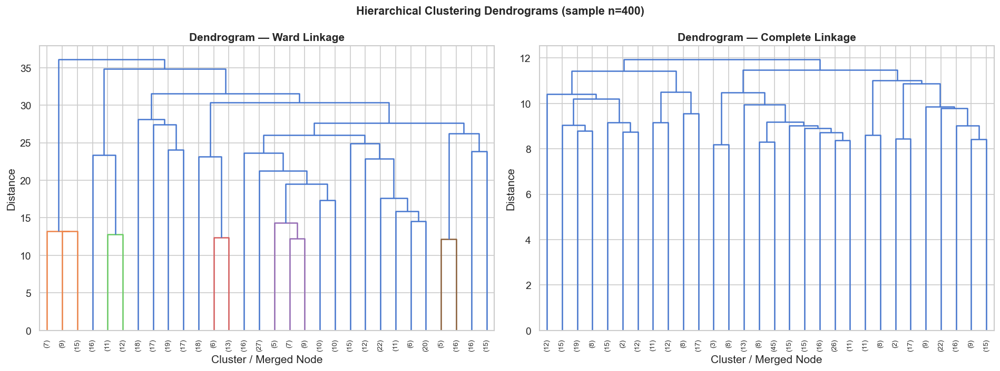

Hierarchical clustering was applied on PCA-reduced features (20 components, ~70% variance retained) using Ward and Complete linkage methods on a representative sample of 400 records.

Both dendrograms support a **3-cluster partition** as the most natural cut:

- **Ward linkage** produces three balanced, compact clusters separated by clear gaps in the merge distance.
- **Complete linkage** identifies a similar structure but with a smaller, more extreme high-seniority cluster.

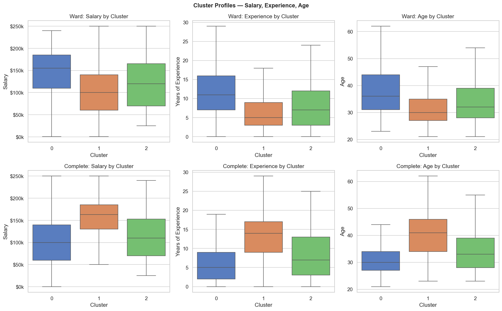

The three clusters map cleanly onto **career stages**:

| Cluster (Ward) | Salary | Experience | Age | Interpretation |
|---|---|---|---|---|
| 0 | Low–Mid | Low | Young | Early-career / Junior |
| 1 | Mid | Mid | Mid | Mid-career Professional |
| 2 | High | High | Older | Senior / Leadership |

The dominant clustering dimension is career stage — driven by the combination of Years of Experience, Age, and Salary. Demographic variables (Gender, Race, Country) play a minimal structural role, consistent with their weak correlation with salary found throughout the EDA.

---

## 12. Overall Project Conclusions

1. **Career progression is the primary driver of salary.** Years of Experience and Job Title together explain the vast majority of salary variance (CV R² ≈ 0.82). Demographic variables (Gender, Race, Country) add negligible predictive power.

2. **Multicollinearity is the main modelling challenge.** Age–Experience collinearity and Country–Race structural association must be handled through variable selection or regularisation. Forward selection is the recommended approach for this dataset.

3. **Job Title is the single most important variable.** It predicts Salary, Gender (via occupational sorting), and Seniority — and therefore must be represented carefully (grouping rare categories, avoiding one-hot explosion).

4. **Gender nulls carry structural information** and should be preserved as an explicit category rather than deleted or imputed. Their association with higher salaries suggests they represent senior/executive records where gender was not reported.

5. **Three natural employee segments** emerge from clustering: junior, mid-career, and senior professionals. These segments are robust across both Ward and Complete linkage methods and align with the salary and experience gradients identified in the EDA.

6. **The forward-selected linear regression model is recommended for production deployment**: it matches the full model's predictive accuracy (CV R² ≈ 0.83, RMSE ≈ \$22k), reduces multicollinearity, and retains interpretable, business-meaningful features.
